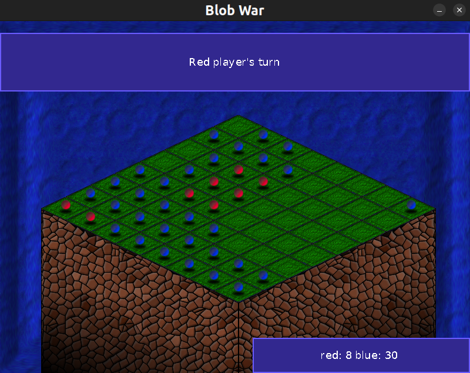

# BlobWar-AI

[**BlobWar-AI**](https://github.com/PyroWilDx/BlobWar-AI/) is a parallelized alpha-beta algorithm developed to play [BlobWar](#blobwar-game).

> [!NOTE]
> - [Project Report](./Report.pdf)

This project was made in a **Team of 1** as part of the **Advanced Algorithms & Complexity** course at [Grenoble INP &ndash; Ensimag](https://ensimag.grenoble-inp.fr/).

## BlobWar Game

**BlobWar** is a two-player chessboard-game. On each turn, a player moves a blob either by duplicating it on an adjacent square, or jumping it two squares away without duplication. After a move, any opposing blobs on adjacent squares to the target square will change color.



## Development Set-Up

<div align="center">

| [](https://isocpp.org/) | [](https://code.visualstudio.com/) | [](https://www.linux.org/) |
|---|---|---|

</div>

### How To Use

```
make && ./blobwar
```

---

<div align="center">
  Copyright &#169; 2024 PyroWilDx. All Rights Reserved.
</div>
